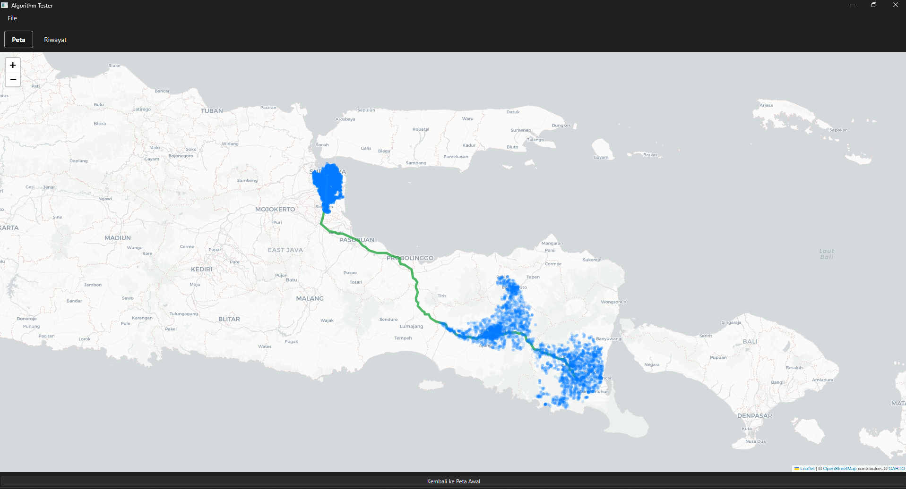
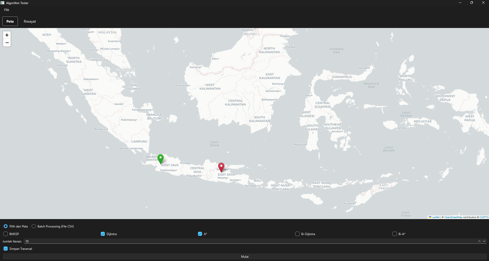
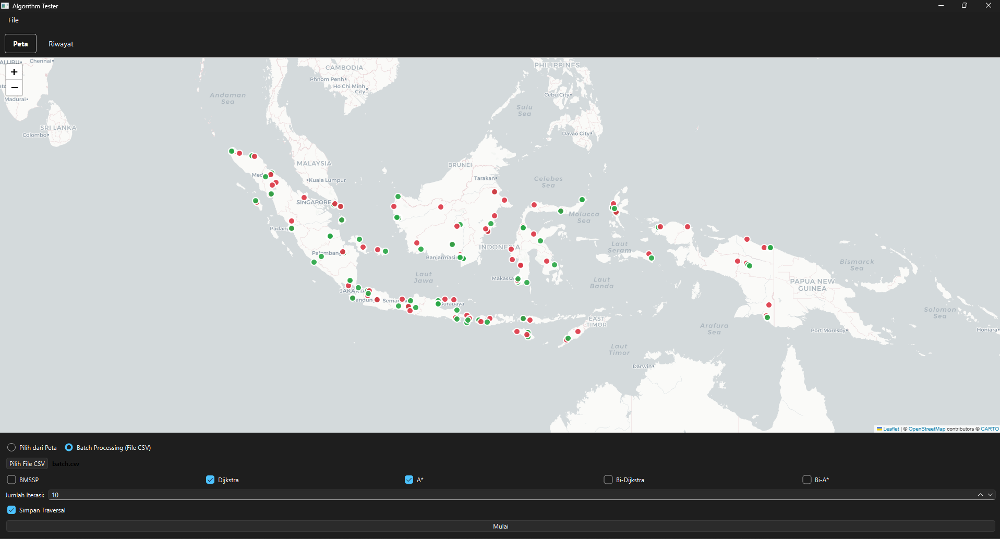
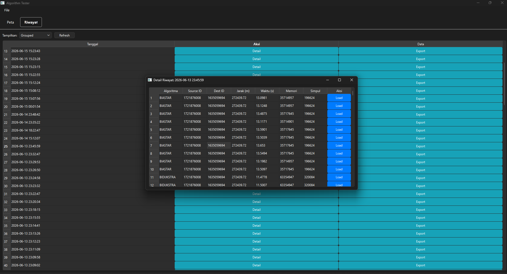

# AlgTester

AlgTester is a desktop app built with PySide6 to visualize and benchmark Single-Source Shortest Path Algorithms (Dijkstra, A*, Bidirectional Dijkstra, Bidirectional A* and BMSSP) on large-scale Indonesia graph data stored in Sqlite. Features include single and batch testing, benchmark history, route visualization and traversal visualization.

## Preview

Below is a preview of AlgTester.

